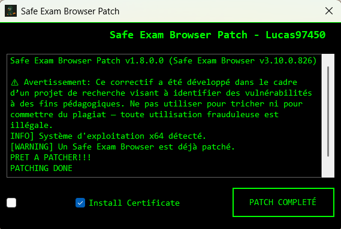

# Safe Exam Browser Patch – Lucas97450



Une application Windows (WinForms, .NET Framework 4.5) qui automatise la sauvegarde et le remplacement contrôlé de composants de Safe Exam Browser (SEB).

## Avertissement important

Ce correctif a été développé dans le cadre d’un projet de recherche visant à identifier des vulnérabilités à des fins pédagogiques. Ne pas utiliser pour tricher ni pour commettre du plagiat — toute utilisation frauduleuse est illégale. L’auteur n’est en aucun cas responsable des conséquences d’un usage non autorisé.

## Sommaire

- Aperçu
- Fonctionnalités
- Prérequis
- Installation (Release)
- Utilisation (mode normal et hors‑ligne)
- Démo (vidéo)
- Restauration et désinstallation
- Compilation (Build) locale
- Dépannage
- Structure du projet
- Licence & crédits

## Aperçu

- Sauvegarde optionnelle (backup) des binaires SEB
- Remplacement contrôlé de 6 composants SEB (x86/x64)
- Installation optionnelle d’un certificat (online/offline)
- Mode hors‑ligne pour patcher une autre partition / image Windows

## Fonctionnalités

- Détection auto x86/x64 et version SEB supportée
- Patch en ligne (système courant) ou **Offline Patcher** (autre partition)
- Logs détaillés dans l’interface

## Prérequis

- Windows 10 (x64 recommandé)
- .NET Framework 4.5
- Safe Exam Browser 3.10.0.826 installé (pour le mode en ligne)
- Droits administrateur

## Installation (Release)

1. Téléchargez l’archive Release (ZIP) ou l’exécutable `patch-seb-lucas.exe`.
2. Décompressez si besoin, puis exécutez en tant qu’administrateur.

## Utilisation

### Mode normal

1. Lancez `patch-seb-lucas.exe`.
2. Cochez « Backup » si vous souhaitez une sauvegarde des fichiers d’origine.
3. Cochez « Install Certificate » si vous devez installer le certificat associé.
4. Cliquez sur « PATCH » et suivez les logs.

### Mode hors‑ligne

1. Lancez `patch-seb-lucas.exe /offline` (ou exécutez depuis Windows PE).
2. Sélectionnez la partition contenant l’installation de SEB.
3. Activez « Auto‑Detect » (ou forcez x86/x64 si nécessaire).
4. Optionnel : installer le certificat dans la ruche offline.
5. Cliquez sur « PATCH ».

## Démo (vidéo):

<details>
<summary>Voir la démo (mp4)</summary>

Si votre navigateur le supporte, la vidéo sera lisible localement :

```html
<video src="./docs/demo.mp4" controls width="720"></video>
```

Sinon, uploadez la vidéo en « Release asset » et remplacez ce lien par l’URL publique.
</details>

## Restauration / Désinstallation

- Si le mode « Backup » a été utilisé, les fichiers `.backup` sont créés à côté des binaires remplacés. Restaurez en renommant/téléchargeant les originaux selon vos besoins.

## Compilation (Build) locale

1. Ouvrir `patch-seb-lucas.csproj` dans Visual Studio (Windows).
2. Configuration: **Release**, Plateforme: **Any CPU** (ou x64).
3. Build → Rebuild Solution. L’exécutable est généré dans `bin/Release/`.

## Dépannage

- CS7065 (icône) : assurez‑vous que `logo.ico` est valide et référencé dans le `.csproj`.
- Form errors (Dispose/override) : vérifiez que les partial classes partagent le même namespace et que `Form1 : Form` (héritage) est bien présent.
- « Access denied » : exécutez en tant qu’administrateur.

## Structure du projet

```
patch-seb-lucas/
├─ Form1.*                 # UI principale (mode en ligne)
├─ OfflinePatcher.*        # UI hors‑ligne (partitions/images)
├─ ThemeHelper.cs          # Thème vert/néon sur fond noir
├─ Properties/             # Ressources et settings
├─ Resources/              # Binaires & certificats embarqués (x86/x64)
├─ logo.ico                # Icône de l’application
└─ README.md
```

## Licence & crédits

- Voir le fichier `LICENSE` du dépôt.
- Safe Exam Browser est une marque et un produit d’ETH Zurich. Ce projet est indépendant.

---

Made by [Lucas97450](https://github.com/Lucas97450)
